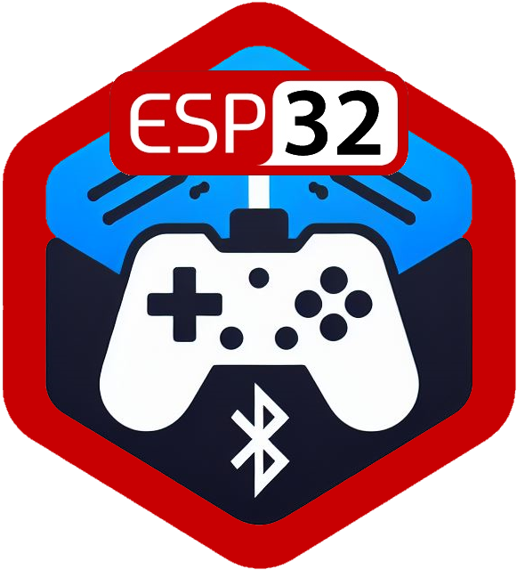
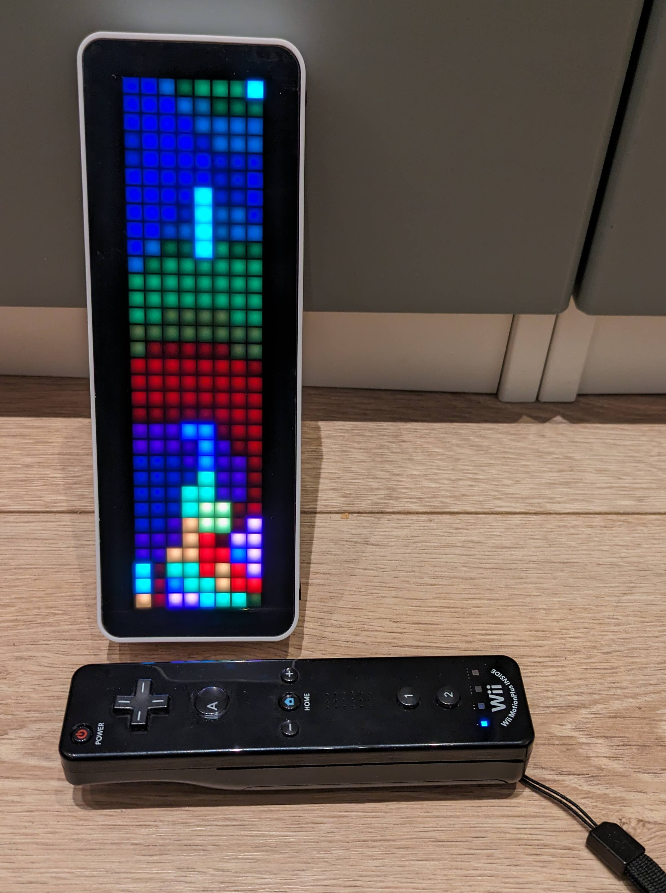

<a name="readme-top"></a>
<!-- PROJECT SHIELDS -->
<!--
*** I'm using markdown "reference style" links for readability.
*** Reference links are enclosed in brackets [ ] instead of parentheses ( ).
*** See the bottom of this document for the declaration of the reference variables
*** for contributors-url, forks-url, etc. This is an optional, concise syntax you may use.
*** https://www.markdownguide.org/basic-syntax/#reference-style-links
-->
[![Contributors][contributors-shield]][contributors-url]
[![Forks][forks-shield]][forks-url]
[![Stargazers][stars-shield]][stars-url]
[![Issues][issues-shield]][issues-url]


<!-- PROJECT LOGO -->
<br />
<div align="center">
  <h3 align="center">
  <div><a href="https://github.com/fredzo/esp32-gamepad-host/"></a>ESP32 Gamepad Host (WIP)</div>
  </h3>
  <p align="center">
    Bluetooth gamepad host library for ESP32 based on <a href="https://github.com/bluekitchen/btstack">btstack</a>.
  </p>
</div>

<!-- ABOUT THE PROJECT -->
## About The Project

![ESP32 Gamepad Host][product-screenshot]

This library is a host driver used to connect bluetooth gamepads and joysticks to ESP32 projects.

It is based on [Bluekitchen's btstack bluetooth stack](https://github.com/bluekitchen/btstack).



[](https://www.youtube.com/watch?v=ef1hPXLthwk)] 

## Built With

This project is built this frameworks/libraries:
* [![PlatformIO][PlatformIO]][PlatformIO-url]
* [![ESP32][ESP32]][ESP32-url]
* [![btstack][btstack]][btstack-url]


<!-- USAGE EXAMPLES -->
## Usage

### Simple connection

TODO 

### Rumple and leds

TODO

<!-- BUILD AND INSTALL -->
## Build And Install

### Build

To build the project, you just have to run **Build** command in PlatformIO.
  ```sh
  Build
  ```

### Installation

Installation is performed with **Upload** or **Upload and Monitor** commands in PlatformIO while the Awtris device is connected via USB.
   ```sh
   Upload and Monitor
   ```

<!-- ROADMAP -->
## Roadmap

- [x] TODO
- [ ] Documentation
    - [ ] English Readme
    - [ ] French Readme 

See the [open issues](https://github.com/fredzo/esp32-gamepad-host/issues) for a full list of proposed features (and known issues).

<!--p align="right">(<a href="#readme-top">back to top</a>)</p-->


<!-- CONTRIBUTING -->
## Contributing

Contributions are what make the open source community such an amazing place to learn, inspire, and create. Any contributions you make are **greatly appreciated**.

If you have a suggestion that would make this better, please fork the repo and create a pull request. You can also simply open an issue with the tag "enhancement".
Don't forget to give the project a star! Thanks again!

1. Fork the Project
2. Create your Feature Branch (`git checkout -b feature/AmazingFeature`)
3. Commit your Changes (`git commit -m 'Add some AmazingFeature'`)
4. Push to the Branch (`git push origin feature/AmazingFeature`)
5. Open a Pull Request

<!--p align="right">(<a href="#readme-top">back to top</a>)</p-->


<!-- LICENSE -->
## License

Distributed under the MIT License. See `LICENSE.txt` for more information.

<!--p align="right">(<a href="#readme-top">back to top</a>)</p-->


<!-- CONTACT -->
## Contact

Fredzo - [https://github.com/fredzo](https://github.com/fredzo)

Project Link: [https://github.com/fredzo/esp32-gamepad-host](https://github.com/fredzo/esp32-gamepad-host)

<!--p align="right">(<a href="#readme-top">back to top</a>)</p-->


<!-- MARKDOWN LINKS & IMAGES -->
<!-- https://www.markdownguide.org/basic-syntax/#reference-style-links -->
[contributors-shield]: https://img.shields.io/github/contributors/fredzo/esp32-gamepad-host.svg?style=for-the-badge
[contributors-url]: https://github.com/fredzo/esp32-gamepad-host/graphs/contributors
[forks-shield]: https://img.shields.io/github/forks/fredzo/esp32-gamepad-host.svg?style=for-the-badge
[forks-url]: https://github.com/fredzo/esp32-gamepad-host/network/members
[stars-shield]: https://img.shields.io/github/stars/fredzo/esp32-gamepad-host.svg?style=for-the-badge
[stars-url]: https://github.com/fredzo/esp32-gamepad-host/stargazers
[issues-shield]: https://img.shields.io/github/issues/fredzo/esp32-gamepad-host.svg?style=for-the-badge
[issues-url]: https://github.com/fredzo/esp32-gamepad-host/issues
[product-screenshot]: docs/esp32-gamepad-host.jpg
[PlatformIO]: https://img.shields.io/badge/platformio.org-000000?style=for-the-badge&logo=platformio&logoColor=orange
[PlatformIO-url]: https://platformio.org/
[ESP32]: https://img.shields.io/badge/espressif.com-000000?style=for-the-badge&logo=espressif&logoColor=red
[ESP32-url]: https://espressif.com/en/products/socs/esp32
[btstack]: https://img.shields.io/badge/btstack-000000?style=for-the-badge&logo=github&logoColor=cyan
[btstack-url]: https://github.com/bluekitchen/btstack